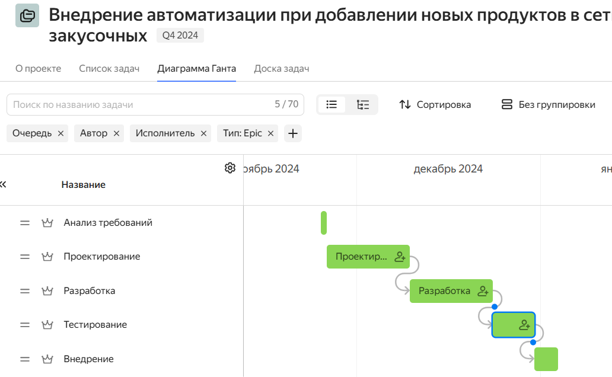

= ТЗ на разработку

== UseCase
. Пользователь нажимает кнопку ОК
. Система отправляет запрос

* Ответ
* Ошибка

link:https://github.com/lolik-z/DocsAsCode-practicum-TL-2024-09.git[Проект GIT] 

*Жирный шрифт* Обычный шрифт

_Курсив_ 

[cols="2,1", options="header"]
|===
|Заголовок 1|Заголовок 2|
ячейка 3|ячейка 4|
ячейка 5|ячейка 6
|===
тектст